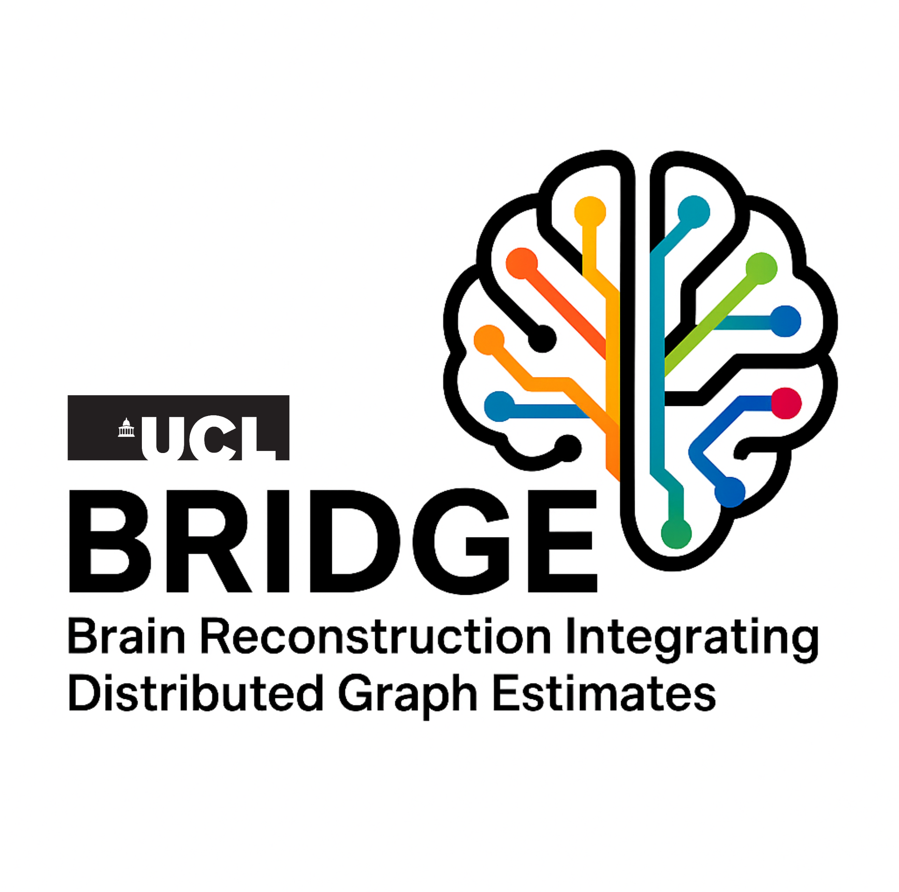

> [! Note]
> Find full docs here: 

**Andrew Keenlyside**

*Multi-scale X-Ray Imaging Group, Mechanical Engineering, University College London*

> [! Project Homepage]
> https://bridge-neuroscience.github.io/

## Summary

BRIDGE is a distributed spatial graph framework as an alternative to traditional tractography methods in terabyte-scale brain imaging.
This project is principally developed for hierarchical phase-contrast tomography (HiP-CT), an ex-vivo synchrotron imaging modality.
This approach adaptively samples nodes in white matter regions and assigns them orientations derived from structure tensors (predominant image texture oreintation)
before defining local probabibilistic spatial graphs. From abstracted representations of these local graphs, BRIDGE defines a hierarchical tree of links between
these local graphs to build a whole-brain analysis framework. This allows for selective or spatially defined extraction of probabilistic tractograms.

This work is funded by the NIH CONNECTS LINC Project, CIFAR, Human Organ Atlas (ESRF, Chang-Zuckerburg Initiative), and UCL Mechanical Engineering.

> [! Documentation]
> Find full docs here: 

